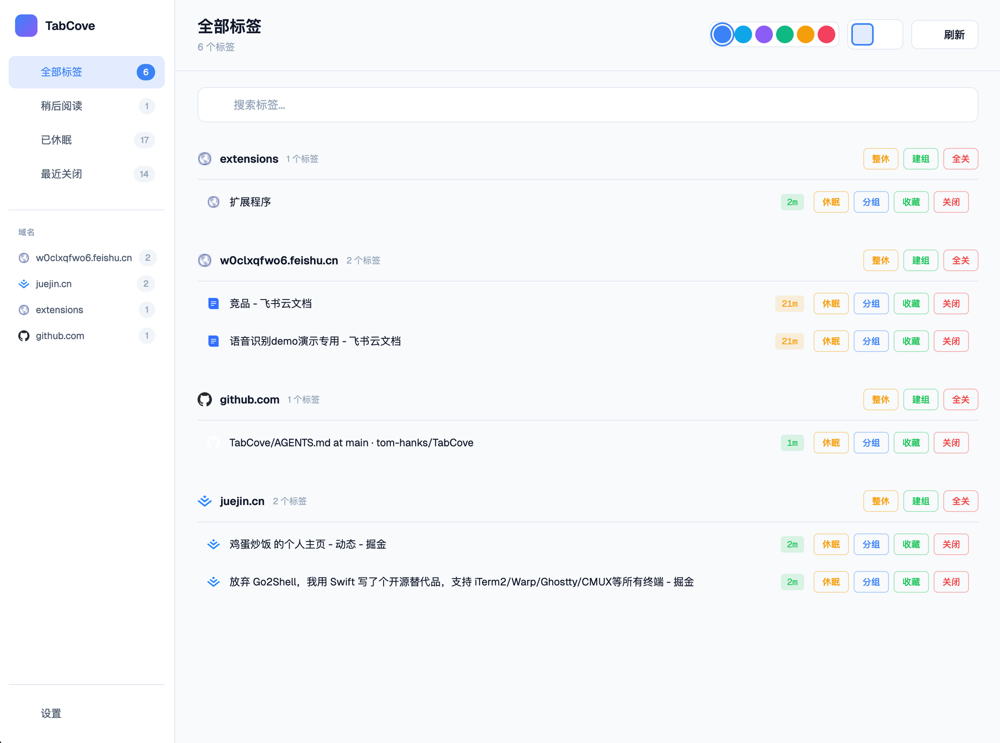

# TabCove - 标签页管理专家

<p align="center">
  
</p>

<p align="center">
  <strong>让标签页井然有序</strong><br>
  告别凌乱，从容管理
</p>

<p align="center">
  <a href="https://github.com/tom-hanks/TabCove/stargazers">
    
  </a>
  <a href="https://github.com/tom-hanks/TabCove/issues">
    
  </a>
  
</p>

---

## 功能特性

### 核心能力

| 功能 | 说明 |
|------|------|
| **标签页分组** | 按域名自动分组，清晰展示所有打开的标签页 |
| **一键休眠** | 休眠不常用的标签页，释放内存但保留恢复能力 |
| **稍后阅读** | 收藏标签页，随时打开继续浏览 |
| **最近关闭** | 误关也能找回，支持一键恢复 |
| **浏览器原生分组** | 可将同域名标签页创建为 Chrome 原生分组 |

### 交互体验

- **主题切换** - 支持浅色/深色模式，6 种主题色可选
- **搜索过滤** - 快速定位目标标签页
- **键盘友好** - 所有操作均可通过快捷键完成
- **响应迅速** - 毫秒级切换，告别加载等待

### 数据安全

- **100% 本地存储** - 数据仅保存在本地，绝不上传
- **Chrome Storage** - 利用浏览器原生存储，安全可靠
- **无外部依赖** - 无服务器、无账号、无追踪

---

## 快速上手

### 安装步骤

**1. 下载扩展**

```bash
# 克隆仓库
git clone https://github.com/tom-hanks/TabCove.git
cd TabCove
```

**2. 加载扩展**

1. 打开 Chrome，访问 `chrome://extensions`
2. 右上角开启 **开发者模式**
3. 点击 **加载已解压的扩展程序**
4. 选择项目中的 `extension/` 文件夹

**3. 开始使用**

打开新标签页即可看到 TabCove 界面。

### 配合 AI 代理使用

将仓库地址发送给 AI 编程助手（Claude Code、Codex 等），说"帮我安装这个"：

```
https://github.com/tom-hanks/TabCove
```

AI 会自动引导你完成安装。

---

## 界面预览



---

## 技术实现

| 层级 | 技术方案 |
|------|----------|
| 扩展框架 | Chrome Manifest V3 |
| 数据存储 | chrome.storage.local |
| 音频合成 | Web Audio API（无音频文件） |
| 动画效果 | CSS Transitions + Canvas |
| 图标 | Google Favicon API |

---

## 项目结构

```
TabCove/
├── extension/
│   ├── manifest.json      # 扩展配置
│   ├── background.js      # Service Worker
│   ├── app.js             # 主应用逻辑
│   ├── index.html         # 新标签页
│   ├── style.css          # 样式表
│   ├── suspended.html      # 休眠提示页
│   └── icons/             # 图标资源
├── README.md              # 中文说明
├── AGENTS.md              # AI 代理安装指南
└── CLAUDE.md              # Claude Code 上下文
```

---

## 更新日志

### v1.0.0
- 标签页分组管理
- 休眠/唤醒功能
- 稍后阅读收藏
- 最近关闭恢复
- 浏览器原生分组
- 浅色/深色主题
- 6 种主题色

---

## 许可证

[MIT License](LICENSE)

---

<a href="https://juejin.cn/user/3790771820966440/posts">
  Built by laryers
</a>
